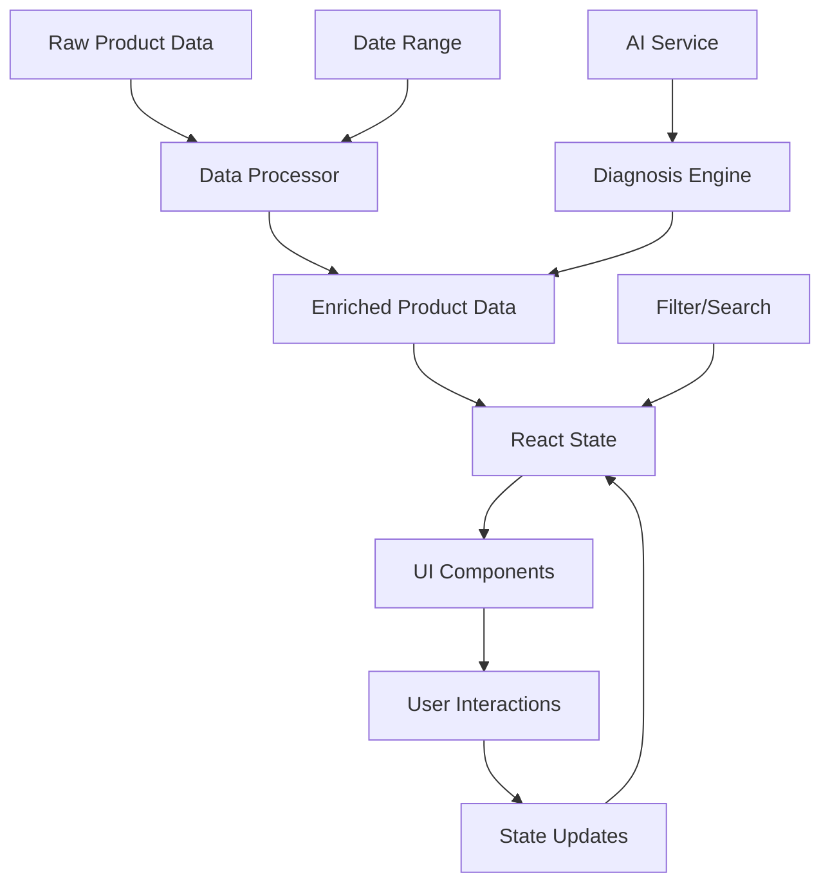

# Design Document: Product Profitability Analysis Dashboard

## Overview

Bu doküman, e-ticaret işletmeleri için kapsamlı bir ürün karlılık analizi dashboard'unun teknik tasarımını tanımlar. Sistem, React + Vite tabanlı bir SaaS uygulaması olarak geliştirilecek ve Recharts ile görselleştirme, Tailwind CSS ile styling yapılacaktır.

### Temel Özellikler

- **Unit Economics Analizi**: Ürün bazında detaylı gelir-gider kırılımı
- **Görsel Analitik**: Sankey diyagramları, trend grafikleri, sparkline'lar
- **AI Destekli Öngörüler**: Otomatik teşhis ve aksiyon önerileri
- **Simülasyon Araçları**: Fiyat değişikliği etki analizi
- **Responsive Tasarım**: Mobil, tablet ve desktop desteği
- **Performans Optimizasyonu**: Büyük veri setleri için optimize edilmiş

### Teknoloji Stack

- **Frontend Framework**: React 18+ with Hooks
- **Build Tool**: Vite
- **Styling**: Tailwind CSS
- **Charts**: Recharts
- **State Management**: React Context API / Redux Toolkit
- **Icons**: Lucide React
- **Utilities**: clsx, date-fns

## Architecture

### Component Hierarchy

```
ProductProfitability (Main Container)
├── Header
│   ├── Title & Description
│   └── Export Button
├── KPICards
│   ├── MarginCard
│   ├── LossMakersCard
│   ├── MERCard
│   └── ReturnLossCard
├── AnalysisSection
│   ├── SankeyDiagram
│   └── TrendAnalysis
│       ├── WinnersList
│       └── LosersList
├── UnitEconomicsTable
│   ├── TableHeader (Sortable)
│   ├── TableBody
│   │   └── ProductRow (Expandable)
│   └── Pagination
└── Modals
    ├── ProductDetailModal
    │   ├── BasicInfo
    │   ├── ProfitabilityMetrics
    │   ├── MarketingMetrics
    │   ├── QualityMetrics
    │   └── PriceSimulator
    ├── ExpenseDetailModal
    ├── MarginAnalysisModal
    ├── LossMakersModal
    ├── MERModal
    └── ReturnLossModal
```

### Data Flow



## Components and Interfaces

### Core Data Models

#### Product Interface

```typescript
interface Product {
  id: number;
  name: string;
  sku: string;
  brand: string;
  category: string;
  image: string;
  
  // Cost Structure
  cogs: number;              // Cost of Goods Sold
  shipping: number;          // Shipping cost per unit
  adSpend: number;          // Ad spend per unit
  fixedCost: number;        // Fixed overhead per unit
  
  // Sales Data
  unitsSold: number;
  stock: number;
  
  // Channel Distribution
  channels: Channel[];
  
  // Calculated Metrics
  salesPrice: number;        // Weighted average price
  commission: number;        // Weighted average commission
  totalVariableCosts: number;
  netProfit: number;         // Per unit net profit
  margin: number;            // Profit margin percentage
  
  // Trend Data
  trendValue: number;        // Change in profit
  trendPercent: number;      // Percentage change
  lastMonthProfit: number;
  lastMonthUnits: number;
  trendUnits: number;
  trendUnitsPercent: number;
  sparklineData: SparklinePoint[];
  
  // AI Diagnosis
  diagnosis?: Diagnosis;
}

interface Channel {
  id: string;
  name: string;
  type: 'marketplace' | 'web';
  price: number;
  commission: number;
  units: number;
  netProfit?: number;
  margin?: number;
}

interface SparklinePoint {
  day: number;
  value: number;
}

interface Diagnosis {
  type: 'profit_drop' | 'high_cpa' | 'low_margin' | 'volume_drop' | 'high_returns' | 'demand_drop' | 'stock_bloat';
  badge: string;
  actionLabel: string;
  actionIcon: LucideIcon;
  actionTooltip: string;
  actionColor: 'red' | 'amber' | 'blue' | 'gray';
}
```

#### Unit Economics Data Model

```typescript
interface UnitEconomicsItem {
  id: number;
  name: string;
  sku: string;
  image: string;
  price: number;
  sold: number;
  revenue: number;
  returns: number;
  returnAmt: number;
  cogs: number;
  variableCosts: number;
  ads: number;
  fixed: number;
  netProfit: number;
  margin: number;
  isLoss: boolean;
}
```

#### KPI Metrics

```typescript
interface KPIMetrics {
  avgMargin: number;
  lossMakersCount: number;
  mer: number;              // Marketing Efficiency Ratio
  returnLoss: number;
  marginTrend: number;      // Percentage change
  lossMakersTrend: number;
  merTrend: number;
  returnLossTrend: number;
}
```

### Component Specifications

#### 1. KPICards Component

**Props:**
```typescript
interface KPICardsProps {
  metrics: KPIMetrics;
  onCardClick: (cardType: 'margin' | 'loss' | 'mer' | 'return') => void;
}
```

**Responsibilities:**
- Display 4 key performance indicators
- Show trend indicators (up/down arrows)
- Handle click events to open detail modals
- Responsive grid layout (1 col mobile, 2 col tablet, 4 col desktop)

**Styling:**
- White background with subtle shadow
- Colored accent icons (emerald, rose, amber, purple)
- Hover effects for interactivity
- Trend badges with color coding

#### 2. SankeyDiagram Component

**Props:**
```typescript
interface SankeyDiagramProps {
  data: SankeyData;
  onNodeClick: (node: SankeyNode) => void;
}

interface SankeyData {
  nodes: SankeyNode[];
  links: SankeyLink[];
}

interface SankeyNode {
  name: string;
  type: 'source' | 'target';
  icon?: LucideIcon;
  color?: string;
  value: number;
  percent: number;
}

interface SankeyLink {
  source: number;
  target: number;
  value: number;
}
```

**Responsibilities:**
- Render revenue flow visualization
- Show proportional flow widths
- Handle node click for expense details
- Animate on hover
- Responsive scaling

**Implementation Details:**
- Use Recharts Sankey component
- Custom node renderer for styled cards
- Custom link renderer with gradients
- SVG-based for scalability

#### 3. TrendAnalysis Component

**Props:**
```typescript
interface TrendAnalysisProps {
  products: Product[];
  metric: 'profit' | 'volume';
  onMetricChange: (metric: 'profit' | 'volume') => void;
  onProductClick: (product: Product) => void;
}
```

**Responsibilities:**
- Display winners and losers lists
- Toggle between profit and volume metrics
- Show sparkline charts
- Display diagnosis badges for losers
- Handle AI consultation triggers

**Layout:**
- Split view (50/50) for winners/losers
- Scrollable lists
- Sticky headers
- Color-coded sections (emerald for winners, rose for losers)

#### 4. UnitEconomicsTable Component

**Props:**
```typescript
interface UnitEconomicsTableProps {
  data: UnitEconomicsItem[];
  currentPage: number;
  rowsPerPage: number;
  sortConfig: SortConfig;
  expandedRows: Set<number>;
  onSort: (column: string) => void;
  onPageChange: (direction: 1 | -1) => void;
  onRowsPerPageChange: (rows: number) => void;
  onRowExpand: (id: number) => void;
  onProductClick: (item: UnitEconomicsItem) => void;
}

interface SortConfig {
  column: string;
  direction: 'asc' | 'desc';
}
```

**Responsibilities:**
- Display paginated product list
- Support column sorting
- Show expandable row details
- Highlight loss-making products
- Handle row click for detail modal
- Display summary totals row

**Features:**
- Sticky header on scroll
- Zebra striping for readability
- Responsive table (card view on mobile)
- Loading states
- Empty state handling

#### 5. ProductDetailModal Component

**Props:**
```typescript
interface ProductDetailModalProps {
  product: EnrichedProduct | null;
  isOpen: boolean;
  onClose: () => void;
  onAIConsult: (product: Product, diagnosisType: string) => void;
}

interface EnrichedProduct extends Product {
  stock: number;
  daysLeft: number;
  roas: string;
  cr: string;
  score: string;
  returnRatePct: number;
  reasons: ReturnReason[];
}

interface ReturnReason {
  label: string;
  pct: number;
}
```

**Tabs:**
1. **Overview**: Basic info, profitability, stock status
2. **Marketing**: ROAS, conversion rate, ad spend breakdown
3. **Quality**: Rating, return rate, return reasons chart
4. **Channels**: Performance by sales channel
5. **Simulator**: Price simulation tool

**Responsibilities:**
- Display comprehensive product data
- Tab navigation
- Price simulator with real-time calculations
- Return reasons pie chart
- Channel comparison table
- Close on outside click or ESC key

#### 6. PriceSimulator Component

**Props:**
```typescript
interface PriceSimulatorProps {
  product: Product;
  simulationState: SimulationState;
  onPriceChange: (newPrice: number) => void;
  onAdjust: (amount: number) => void;
  onReset: () => void;
}

interface SimulationState {
  price: number;
  margin: number;
  profit: number;
  diffMargin: number;
  newProfit: number;
}
```

**Responsibilities:**
- Real-time profit calculation
- Price adjustment buttons (+/- 10, 50, 100)
- Margin comparison display
- Volume elasticity consideration
- Reset to original values

**Calculation Logic:**
```typescript
function calculateSimulation(newPrice: number, product: Product): SimulationState {
  const totalCost = product.cogs + product.variableCosts + product.ads + product.fixed;
  const newUnitProfit = newPrice - totalCost;
  const newMargin = (newUnitProfit / newPrice) * 100;
  const diffMargin = newMargin - product.margin;
  
  // Simple elasticity: 1% price increase = 0.5% volume decrease
  const priceChange = ((newPrice - product.salesPrice) / product.salesPrice) * 100;
  const volumeChange = priceChange * -0.5;
  const newVolume = product.unitsSold * (1 + volumeChange / 100);
  const totalProfit = newUnitProfit * newVolume;
  
  return {
    price: newPrice,
    margin: newMargin,
    profit: newUnitProfit,
    diffMargin,
    newProfit: totalProfit
  };
}
```

## Data Models

### Data Processing Pipeline

#### 1. Revenue Calculation
```typescript
function calculateRevenue(product: RawProduct): number {
  return product.channels.reduce((sum, ch) => sum + (ch.price * ch.units), 0);
}
```

#### 2. Ad Budget Allocation
```typescript
function allocateAdBudget(products: RawProduct[], totalBudget: number): Product[] {
  const totalRevenue = products.reduce((sum, p) => sum + calculateRevenue(p), 0);
  
  return products.map(product => {
    const revenue = calculateRevenue(product);
    const revenueShare = revenue / totalRevenue;
    const allocatedBudget = totalBudget * revenueShare;
    const adSpendPerUnit = allocatedBudget / product.unitsSold;
    
    return {
      ...product,
      adSpend: adSpendPerUnit,
      allocatedAdBudget: allocatedBudget,
      revenueShare
    };
  });
}
```

#### 3. Net Profit Calculation
```typescript
function calculateNetProfit(product: Product): number {
  const avgPrice = product.channels.reduce((sum, ch) => 
    sum + (ch.price * ch.units), 0) / product.unitsSold;
  
  const avgCommission = product.channels.reduce((sum, ch) => 
    sum + (ch.commission * ch.units), 0) / product.unitsSold;
  
  const totalCosts = product.cogs + product.shipping + avgCommission + 
                     product.adSpend + product.fixedCost;
  
  return avgPrice - totalCosts;
}
```

#### 4. Trend Analysis
```typescript
function calculateTrend(product: Product, isWinner: boolean): TrendData {
  const magnitude = (Math.random() * 0.25) + 0.05; // 5-30% change
  const baseProfit = product.netProfit || 0;
  const profitChangeAmount = Math.abs(baseProfit) * magnitude;
  const trendValue = isWinner ? profitChangeAmount : -profitChangeAmount;
  
  const lastMonthProfit = baseProfit - trendValue;
  const trendPercent = lastMonthProfit !== 0 ? 
    (trendValue / Math.abs(lastMonthProfit)) * 100 : 0;
  
  return {
    trendValue,
    trendPercent,
    lastMonthProfit,
    sparklineData: generateSparklineData(lastMonthProfit, baseProfit)
  };
}
```

#### 5. Diagnosis Engine
```typescript
function diagnoseProduct(product: Product): Diagnosis | null {
  if (product.trendValue < 0) {
    // Profit losers
    const scenarios: Diagnosis[] = [
      {
        type: 'profit_drop',
        badge: 'KAR DÜŞÜŞÜ',
        actionLabel: 'Rekabeti İncele',
        actionIcon: TrendingUp,
        actionTooltip: 'Ürün karlı ama kar marjı düşüş trendinde.',
        actionColor: 'amber'
      },
      {
        type: 'high_cpa',
        badge: 'CPA ALARMI',
        actionLabel: 'Durdur',
        actionIcon: PauseCircle,
        actionTooltip: 'Reklam maliyetleri karı eritiyor.',
        actionColor: 'red'
      },
      // ... more scenarios
    ];
    
    return scenarios[product.id % scenarios.length];
  }
  
  if (product.trendUnits < 0) {
    // Volume losers
    return {
      type: 'demand_drop',
      badge: 'TALEP DÜŞÜŞÜ',
      actionLabel: 'Pazarı İncele',
      actionIcon: Search,
      actionTooltip: 'Satış adedi düşüyor.',
      actionColor: 'blue'
    };
  }
  
  return null;
}
```

### State Management

#### Global State Structure
```typescript
interface AppState {
  products: Product[];
  unitEconomicsData: UnitEconomicsItem[];
  kpiMetrics: KPIMetrics;
  filters: FilterState;
  ui: UIState;
}

interface FilterState {
  searchTerm: string;
  profitabilityFilter: 'all' | 'profitable' | 'loss';
  channelFilter: string[];
  priceRange: [number, number];
  dateRange: DateRange;
}

interface UIState {
  currentPage: number;
  rowsPerPage: number;
  sortConfig: SortConfig;
  expandedRows: Set<number>;
  activeModal: ModalType | null;
  selectedProduct: Product | null;
  trendMetric: 'profit' | 'volume';
}

interface DateRange {
  start: Date;
  end: Date;
  preset: 'last7days' | 'last30days' | 'last3months' | 'last6months' | 'lastyear' | 'custom';
}
```

#### Context Providers
```typescript
// ProductContext.tsx
const ProductContext = createContext<ProductContextValue | undefined>(undefined);

interface ProductContextValue {
  products: Product[];
  filteredProducts: Product[];
  filters: FilterState;
  updateFilters: (filters: Partial<FilterState>) => void;
  resetFilters: () => void;
}

// UIContext.tsx
const UIContext = createContext<UIContextValue | undefined>(undefined);

interface UIContextValue {
  ui: UIState;
  openModal: (type: ModalType, data?: any) => void;
  closeModal: () => void;
  updatePagination: (page: number, rowsPerPage: number) => void;
  toggleRowExpansion: (id: number) => void;
}
```

## Correctness Properties

*A property is a characteristic or behavior that should hold true across all valid executions of a system—essentially, a formal statement about what the system should do. Properties serve as the bridge between human-readable specifications and machine-verifiable correctness guarantees.*

### Property Reflection

After analyzing all acceptance criteria, I identified the following areas where properties can be consolidated:

**Consolidation Decisions:**
1. **Table rendering properties (1.1, 1.6)** can be combined into a single comprehensive property about table data completeness
2. **KPI calculation properties (2.1, 2.2, 2.3, 2.4)** are distinct and should remain separate as each validates different metrics
3. **Trend filtering properties (4.1, 4.2)** can be combined into one property about trend-based categorization
4. **Modal interaction properties** across different requirements are similar but test different modals, so they remain separate
5. **Filter properties (9.2-9.5)** can be consolidated into a general filtering correctness property

### Core Calculation Properties

**Property 1: Net Profit Calculation Accuracy**
*For any* product with defined costs (COGS, shipping, commission, ad spend, fixed costs) and revenue, the calculated net profit should equal revenue minus all costs.

**Validates: Requirements 1.1, 2.1, 6.2**

**Property 2: Margin Calculation Accuracy**
*For any* product with non-zero revenue, the margin percentage should equal (net profit / revenue) × 100.

**Validates: Requirements 1.1, 2.1, 7.4**

**Property 3: MER Calculation Accuracy**
*For any* set of products, the Marketing Efficiency Ratio should equal total revenue divided by total ad spend.

**Validates: Requirements 2.3**

**Property 4: Revenue Share Allocation**
*For any* set of products, the sum of all revenue shares should equal 1.0 (100%).

**Validates: Requirements 1.1**

**Property 5: Ad Budget Distribution**
*For any* product set with total ad budget B, each product's allocated budget should be proportional to its revenue share, and the sum of all allocations should equal B.

**Validates: Requirements 1.1**

### Data Integrity Properties

**Property 6: Loss Maker Identification**
*For any* product, it should be classified as a loss maker if and only if its net profit is less than zero.

**Validates: Requirements 1.5, 2.2**

**Property 7: Table Data Completeness**
*For any* product displayed in the table, all required fields (SKU, name, price, sold units, revenue, returns, COGS, variable costs, ads, fixed costs, net profit, margin) must be present and non-null.

**Validates: Requirements 1.1, 1.6**

**Property 8: Sankey Flow Conservation**
*For any* Sankey diagram, the sum of all outgoing flows from the source node should equal the total revenue, and the sum of all target node values should equal the total revenue.

**Validates: Requirements 3.1, 3.2, 3.6**

### Trend Analysis Properties

**Property 9: Trend Categorization Correctness**
*For any* product, if its trend value is positive, it should appear in the winners list; if negative, in the losers list; if zero, in neither list.

**Validates: Requirements 4.1, 4.2**

**Property 10: Trend Percentage Calculation**
*For any* product with non-zero last month value, the trend percentage should equal (trend value / last month value) × 100.

**Validates: Requirements 4.5**

**Property 11: Sparkline Data Consistency**
*For any* product, the sparkline data should start at last month's value and end at current month's value, with monotonic progression between them.

**Validates: Requirements 4.6**

### Diagnosis and AI Properties

**Property 12: Diagnosis Assignment for Losers**
*For any* product with negative trend value or negative trend units, the system should assign a diagnosis object with type, badge, action label, and tooltip.

**Validates: Requirements 4.7, 5.1, 5.2**

**Property 13: AI Prompt Contextualization**
*For any* product with diagnosis, the generated AI prompt should contain the product name, relevant metrics, and diagnosis-specific context.

**Validates: Requirements 5.4**

### Simulation Properties

**Property 14: Price Simulation Calculation**
*For any* product and new price P, the simulated net profit should equal P minus total costs, and the simulated margin should equal (simulated profit / P) × 100.

**Validates: Requirements 7.2, 7.4, 7.6**

**Property 15: Simulation Reset Idempotence**
*For any* simulation state, resetting should restore original product values, and resetting twice should produce the same result as resetting once.

**Validates: Requirements 7.7**

**Property 16: Volume Elasticity Application**
*For any* price change of X%, the estimated volume change should be -0.5X% (negative correlation with elasticity factor 0.5).

**Validates: Requirements 7.5**

### Filtering and Search Properties

**Property 17: Search Filter Correctness**
*For any* search term T, all filtered products should have either their name or SKU containing T (case-insensitive).

**Validates: Requirements 9.2**

**Property 18: Profitability Filter Correctness**
*For any* profitability filter setting, if set to "profitable", all filtered products should have net profit ≥ 0; if "loss", all should have net profit < 0; if "all", no filtering should occur.

**Validates: Requirements 9.3**

**Property 19: Filter Composition**
*For any* combination of active filters, a product should appear in results if and only if it satisfies all active filter conditions.

**Validates: Requirements 9.2, 9.3, 9.4, 9.5**

**Property 20: Filter Reset Completeness**
*For any* filter state, resetting filters should restore all products to the result set and clear all filter values.

**Validates: Requirements 9.6**

### Sorting and Pagination Properties

**Property 21: Sort Order Correctness**
*For any* column and sort direction, the resulting product list should be ordered according to that column's values in the specified direction (ascending or descending).

**Validates: Requirements 1.3**

**Property 22: Pagination Slice Correctness**
*For any* page number P and page size S, the displayed products should be items from index (P-1)×S to P×S-1 of the filtered product list.

**Validates: Requirements 1.4**

### Aggregation Properties

**Property 23: Summary Row Accuracy**
*For any* set of displayed products, the summary row totals should equal the sum of individual product values for each numeric column.

**Validates: Requirements 1.6**

**Property 24: KPI Metric Aggregation**
*For any* product set, the average margin should equal total net profit divided by total net revenue, weighted by product volumes.

**Validates: Requirements 2.1**

### UI Interaction Properties

**Property 25: Modal State Consistency**
*For any* product selection, opening a detail modal should set the selected product state, and closing should clear it.

**Validates: Requirements 1.2, 6.1**

**Property 26: Expense Detail Modal Data Binding**
*For any* expense node clicked in Sankey diagram, the opened modal should display sub-items that sum to the node's total value.

**Validates: Requirements 3.4, 8.1, 8.2, 8.4**

### Comparison Properties

**Property 27: Comparison Set Size Limit**
*For any* comparison operation, the system should allow selection of at most 5 products.

**Validates: Requirements 16.1**

**Property 28: Benchmark Calculation**
*For any* metric in comparison view, the benchmark line should represent the average value across all products in the dataset.

**Validates: Requirements 16.4**

### Date Range Properties

**Property 29: Date Range Filter Application**
*For any* selected date range [start, end], all displayed data should only include products with transaction dates within that range.

**Validates: Requirements 17.4, 17.7**

**Property 30: Period Comparison Consistency**
*For any* selected date range, the "previous period" should be a range of equal length immediately preceding the selected range.

**Validates: Requirements 17.5**

### Alert Properties

**Property 31: Threshold Alert Triggering**
*For any* product and threshold T, an alert should be triggered if and only if the product's metric value crosses the threshold T.

**Validates: Requirements 18.2, 18.3**

### Bulk Operation Properties

**Property 32: Bulk Selection Consistency**
*For any* set of selected products, bulk operations should apply to exactly those products and no others.

**Validates: Requirements 19.4, 19.5, 19.6**

**Property 33: Select All Completeness**
*For any* product list, "Select All" should select all currently visible (filtered) products.

**Validates: Requirements 19.2**

### Localization Properties

**Property 34: Currency Format Consistency**
*For any* numeric currency value and selected locale, the displayed format should match the locale's currency formatting rules.

**Validates: Requirements 15.3**

**Property 35: Date Format Consistency**
*For any* date value and selected locale, the displayed format should match the locale's date formatting rules.

**Validates: Requirements 15.4**

### Error Handling Properties

**Property 36: Error Message Display**
*For any* error condition, the system should display a user-friendly error message and not expose technical stack traces.

**Validates: Requirements 13.1, 13.7**

**Property 37: Loading State Indication**
*For any* asynchronous operation, the system should display a loading indicator while the operation is in progress.

**Validates: Requirements 13.2**

## Error Handling

### Error Categories

#### 1. Data Loading Errors
- **Network Failures**: API unavailable, timeout, connection lost
- **Data Format Errors**: Invalid JSON, missing required fields
- **Authentication Errors**: Token expired, unauthorized access

**Handling Strategy:**
```typescript
async function loadProducts(): Promise<Product[]> {
  try {
    const response = await fetch('/api/products');
    
    if (!response.ok) {
      throw new Error(`HTTP ${response.status}: ${response.statusText}`);
    }
    
    const data = await response.json();
    return validateProducts(data);
    
  } catch (error) {
    if (error instanceof NetworkError) {
      showNotification('error', 'Bağlantı hatası. Lütfen internet bağlantınızı kontrol edin.');
      return getCachedProducts(); // Fallback to cached data
    }
    
    if (error instanceof ValidationError) {
      logError('Data validation failed', error);
      showNotification('error', 'Veri formatı hatalı. Lütfen destek ekibiyle iletişime geçin.');
      return [];
    }
    
    throw error; // Unexpected errors
  }
}
```

#### 2. Calculation Errors
- **Division by Zero**: Revenue or cost values are zero
- **Invalid Numbers**: NaN, Infinity in calculations
- **Negative Values**: Unexpected negative values in certain fields

**Handling Strategy:**
```typescript
function calculateMargin(netProfit: number, revenue: number): number {
  if (revenue === 0) {
    return 0; // Safe default
  }
  
  const margin = (netProfit / revenue) * 100;
  
  if (!Number.isFinite(margin)) {
    logWarning('Invalid margin calculation', { netProfit, revenue });
    return 0;
  }
  
  return margin;
}

function safeCalculate<T>(
  calculation: () => T,
  fallback: T,
  errorMessage: string
): T {
  try {
    const result = calculation();
    
    if (typeof result === 'number' && !Number.isFinite(result)) {
      logWarning(errorMessage, { result });
      return fallback;
    }
    
    return result;
  } catch (error) {
    logError(errorMessage, error);
    return fallback;
  }
}
```

#### 3. User Input Errors
- **Invalid Price**: Negative or non-numeric price in simulator
- **Invalid Date Range**: End date before start date
- **Invalid Filter Values**: Out of range values

**Handling Strategy:**
```typescript
function validatePriceInput(input: string): ValidationResult {
  const price = parseFloat(input);
  
  if (isNaN(price)) {
    return { valid: false, error: 'Lütfen geçerli bir sayı girin' };
  }
  
  if (price < 0) {
    return { valid: false, error: 'Fiyat negatif olamaz' };
  }
  
  if (price > 1000000) {
    return { valid: false, error: 'Fiyat çok yüksek' };
  }
  
  return { valid: true, value: price };
}
```

#### 4. State Management Errors
- **Stale State**: Component using outdated state
- **Race Conditions**: Multiple async updates
- **Memory Leaks**: Unmounted component updates

**Handling Strategy:**
```typescript
function useAsyncData<T>(fetchFn: () => Promise<T>) {
  const [data, setData] = useState<T | null>(null);
  const [error, setError] = useState<Error | null>(null);
  const [loading, setLoading] = useState(false);
  const isMountedRef = useRef(true);
  
  useEffect(() => {
    return () => {
      isMountedRef.current = false;
    };
  }, []);
  
  const execute = useCallback(async () => {
    setLoading(true);
    setError(null);
    
    try {
      const result = await fetchFn();
      
      if (isMountedRef.current) {
        setData(result);
      }
    } catch (err) {
      if (isMountedRef.current) {
        setError(err as Error);
      }
    } finally {
      if (isMountedRef.current) {
        setLoading(false);
      }
    }
  }, [fetchFn]);
  
  return { data, error, loading, execute };
}
```

### Error Boundaries

```typescript
class ErrorBoundary extends React.Component<Props, State> {
  constructor(props: Props) {
    super(props);
    this.state = { hasError: false, error: null };
  }
  
  static getDerivedStateFromError(error: Error) {
    return { hasError: true, error };
  }
  
  componentDidCatch(error: Error, errorInfo: React.ErrorInfo) {
    logError('React Error Boundary', { error, errorInfo });
  }
  
  render() {
    if (this.state.hasError) {
      return (
        <ErrorFallback
          error={this.state.error}
          resetError={() => this.setState({ hasError: false, error: null })}
        />
      );
    }
    
    return this.props.children;
  }
}
```

### Notification System

```typescript
interface Notification {
  id: string;
  type: 'success' | 'error' | 'warning' | 'info';
  message: string;
  duration?: number;
}

function useNotifications() {
  const [notifications, setNotifications] = useState<Notification[]>([]);
  
  const showNotification = useCallback((
    type: Notification['type'],
    message: string,
    duration = 5000
  ) => {
    const id = generateId();
    const notification: Notification = { id, type, message, duration };
    
    setNotifications(prev => [...prev, notification]);
    
    if (duration > 0) {
      setTimeout(() => {
        setNotifications(prev => prev.filter(n => n.id !== id));
      }, duration);
    }
  }, []);
  
  const dismissNotification = useCallback((id: string) => {
    setNotifications(prev => prev.filter(n => n.id !== id));
  }, []);
  
  return { notifications, showNotification, dismissNotification };
}
```

## Testing Strategy

### Dual Testing Approach

This system requires both **unit tests** and **property-based tests** for comprehensive coverage:

- **Unit tests** verify specific examples, edge cases, and error conditions
- **Property-based tests** verify universal properties across all inputs
- Together they provide comprehensive coverage: unit tests catch concrete bugs, property tests verify general correctness

### Unit Testing

**Focus Areas:**
- Specific calculation examples with known inputs/outputs
- Edge cases (zero values, empty arrays, null handling)
- Error conditions and error handling paths
- Component rendering with specific props
- User interaction flows (click, input, navigation)

**Example Unit Tests:**
```typescript
describe('calculateNetProfit', () => {
  it('should calculate net profit correctly for standard case', () => {
    const product = {
      salesPrice: 1000,
      cogs: 400,
      shipping: 50,
      commission: 100,
      adSpend: 150,
      fixedCost: 50
    };
    
    expect(calculateNetProfit(product)).toBe(250);
  });
  
  it('should handle zero revenue', () => {
    const product = { ...baseProduct, salesPrice: 0 };
    expect(calculateNetProfit(product)).toBe(-750);
  });
  
  it('should handle negative profit', () => {
    const product = { ...baseProduct, cogs: 900 };
    expect(calculateNetProfit(product)).toBeLessThan(0);
  });
});
```

### Property-Based Testing

**Library:** fast-check (for JavaScript/TypeScript)

**Configuration:**
- Minimum 100 iterations per property test
- Each test must reference its design document property
- Tag format: `Feature: product-profitability-analysis, Property {number}: {property_text}`

**Example Property Tests:**
```typescript
import fc from 'fast-check';

describe('Property 1: Net Profit Calculation Accuracy', () => {
  it('should calculate net profit as revenue minus all costs', () => {
    // Feature: product-profitability-analysis, Property 1: Net Profit Calculation Accuracy
    
    fc.assert(
      fc.property(
        fc.record({
          salesPrice: fc.float({ min: 0, max: 10000 }),
          cogs: fc.float({ min: 0, max: 5000 }),
          shipping: fc.float({ min: 0, max: 500 }),
          commission: fc.float({ min: 0, max: 1000 }),
          adSpend: fc.float({ min: 0, max: 1000 }),
          fixedCost: fc.float({ min: 0, max: 500 })
        }),
        (product) => {
          const netProfit = calculateNetProfit(product);
          const expectedProfit = product.salesPrice - 
            (product.cogs + product.shipping + product.commission + 
             product.adSpend + product.fixedCost);
          
          expect(netProfit).toBeCloseTo(expectedProfit, 2);
        }
      ),
      { numRuns: 100 }
    );
  });
});

describe('Property 4: Revenue Share Allocation', () => {
  it('should ensure all revenue shares sum to 1.0', () => {
    // Feature: product-profitability-analysis, Property 4: Revenue Share Allocation
    
    fc.assert(
      fc.property(
        fc.array(
          fc.record({
            id: fc.integer(),
            revenue: fc.float({ min: 1, max: 100000 })
          }),
          { minLength: 1, maxLength: 50 }
        ),
        (products) => {
          const enriched = calculateRevenueShares(products);
          const totalShare = enriched.reduce((sum, p) => sum + p.revenueShare, 0);
          
          expect(totalShare).toBeCloseTo(1.0, 5);
        }
      ),
      { numRuns: 100 }
    );
  });
});

describe('Property 9: Trend Categorization Correctness', () => {
  it('should categorize products correctly based on trend value', () => {
    // Feature: product-profitability-analysis, Property 9: Trend Categorization Correctness
    
    fc.assert(
      fc.property(
        fc.array(
          fc.record({
            id: fc.integer(),
            name: fc.string(),
            trendValue: fc.float({ min: -1000, max: 1000 })
          }),
          { minLength: 1, maxLength: 100 }
        ),
        (products) => {
          const { winners, losers } = categorizeTrends(products);
          
          // All winners should have positive trend
          winners.forEach(p => {
            expect(p.trendValue).toBeGreaterThan(0);
          });
          
          // All losers should have negative trend
          losers.forEach(p => {
            expect(p.trendValue).toBeLessThan(0);
          });
          
          // No product should be in both lists
          const winnerIds = new Set(winners.map(p => p.id));
          const loserIds = new Set(losers.map(p => p.id));
          const intersection = [...winnerIds].filter(id => loserIds.has(id));
          expect(intersection).toHaveLength(0);
        }
      ),
      { numRuns: 100 }
    );
  });
});

describe('Property 17: Search Filter Correctness', () => {
  it('should only return products matching search term', () => {
    // Feature: product-profitability-analysis, Property 17: Search Filter Correctness
    
    fc.assert(
      fc.property(
        fc.array(
          fc.record({
            id: fc.integer(),
            name: fc.string({ minLength: 3, maxLength: 50 }),
            sku: fc.string({ minLength: 5, maxLength: 20 })
          }),
          { minLength: 10, maxLength: 100 }
        ),
        fc.string({ minLength: 1, maxLength: 10 }),
        (products, searchTerm) => {
          const filtered = filterBySearch(products, searchTerm);
          
          filtered.forEach(product => {
            const matchesName = product.name.toLowerCase().includes(searchTerm.toLowerCase());
            const matchesSku = product.sku.toLowerCase().includes(searchTerm.toLowerCase());
            
            expect(matchesName || matchesSku).toBe(true);
          });
        }
      ),
      { numRuns: 100 }
    );
  });
});
```

### Integration Testing

**Focus Areas:**
- Component integration (parent-child communication)
- State management flow
- API integration
- Modal workflows
- Multi-step user flows

**Tools:**
- React Testing Library
- MSW (Mock Service Worker) for API mocking

### E2E Testing

**Focus Areas:**
- Complete user journeys
- Cross-browser compatibility
- Responsive behavior
- Performance under load

**Tools:**
- Playwright or Cypress
- Lighthouse for performance audits

### Test Coverage Goals

- **Unit Tests**: 80%+ code coverage
- **Property Tests**: All 37 correctness properties implemented
- **Integration Tests**: All major component interactions
- **E2E Tests**: Critical user paths (5-10 scenarios)

### Continuous Testing

- Run unit and property tests on every commit
- Run integration tests on pull requests
- Run E2E tests nightly and before releases
- Monitor test execution time and optimize slow tests
